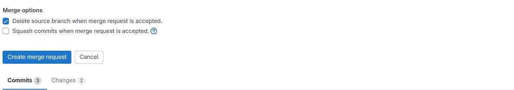

# Kafka Merge Request Config 

This repository implements a way for managing Kafka topics and ACLs through GitLab CI/CD pipelines, triggered by merge requests. It provides a way to propose, validate, and apply changes to Kafka topics and permissions through merge requests.

## Table of Contents
- [1. Setting Up the Development Environment](#1-setting-up-the-development-environment)
- [2. Creating and Submitting Merge Requests for ACL Changes](#2-creating-and-submitting-merge-requests-for-acl-changes)
- [3. Overview of the CI/CD Pipeline Process](#3-overview-of-the-cicd-pipeline-process)
- [4. Example Merge Request and Pipeline Execution](#4-example-merge-request-and-pipeline-execution)
- [5. Defense Workflow](#5-defense-workflow)


## 1. Setting Up the Development Environment

### Prerequisites
- Kafka cluster running on remote server
- Cloning this repository and making merge requests to test

### Initial Setup

1. Clone this repository:
```bash
git clone https://gitlab.com/devopsforcheck/kafka.git
cd kafka
```

## Development Environment

### Local Testing
1. Install the required Python packages:
```bash
pip install kafka-python pyyaml
```

2. Run validation scripts locally:
```bash
python scripts/validate-topics.py
python scripts/validate-acls.py
```

## 2. Creating and Submitting Merge Requests for ACL Changes

### Creating a New Topic

1. Create a new branch:
```bash
git checkout -b add-topic-name
```

2. Create a new YAML file in the `topics/` directory:
```yaml
# topics/my-topic.yaml
topics:
  - name: my-topic
    partitions: 3
    replication_factor: 3
    configs:
      cleanup.policy: delete
      retention.ms: 604800000  # 7 days
```

3. Create corresponding ACLs in the `acls/` directory if needed:
```yaml
# acls/my-topic-permissions.yaml
acls:
  - topic: my-topic
    users:
      - name: service-a
        permissions:
          - read
          - write
      - name: service-b
        permissions:
          - read
```

### Submitting Changes

1. Commit and push your changes to a feature branch:
```bash
git add topics/my-topic.yaml acls/my-topic-permissions.yaml
git commit -m "Add my-topic with permissions"
git push origin add-topic-name
```

2. Create a merge request:
- Go to GitLab > Merge Requests > New Merge Request
- Select your branch as source
- Select `main` branch as target
- Add description of changes
- Submit merge request

## 3. Overview of the CI/CD Pipeline Process


The pipeline consists of two stages:

### 1. Validate Stage
- Automatically triggered when a merge request is created
- Validates YAML syntax
- Checks topic configuration validity
- Verifies ACL configuration correctness
- If verification fails doesn't proceed to deploy

### 2. Deploy Stage
- Runs after merge request is approved and merged
- Creates or deletes Kafka topics
- Applies ACL changes
- Verifies changes were applied successfully

## 4. Example Merge Request and Pipeline Execution

Here's a complete example of creating a new topic with permissions:

1. Create a new branch:
```bash
git checkout -b add-orders-topic
```

2. Create topic configuration:

For topic creation:
```bash
cat > topics/orders-topic.yaml <<EOF
topics:
  - name: orders
    partitions: 3
    replication_factor: 3
    configs:
      cleanup.policy: delete
      retention.ms: 604800000
EOF
```

For topic deletion:
```bash
cat > topics/delete-topic.yaml <<EOF
topics:
  - name: example-topic
    delete: true
EOF
```

3. Create ACL configuration:
```bash
cat > acls/orders-permissions.yaml <<EOF
acls:
  - topic: orders
    users:
      - name: order-service
        permissions:
          - read
          - write
      - name: analytics-service
        permissions:
          - read
EOF
```

4. Commit and push changes:
```bash
git add topics/orders-topic.yaml topics/delete-topic.yaml acls/orders-permissions.yaml
git commit -m "Add orders topic with permissions"
git push origin add-orders-topic
```

5. Create merge request in GitLab UI

### Pipeline Execution

The pipeline will:

1. Validate Stage:
```
Running validation...
✓ orders-topic.yaml is valid
✓ delete-topic.yaml is valid
✓ orders-permissions.yaml is valid
```

2. After successful validation you should manually start deploy if you approve of the changes:
```
Creating topic 'orders'...
Topic 'orders' created successfully
Applying ACL changes...
Added read/write permissions for order-service
Added read permissions for analytics-service
```

### Verification

After deployment, verify the changes in the Kafka ui:
- http://167.99.244.46:8080/ui/

## 5. Defense Workflow

1. Open a terminal in the Kafka project.
2. Create a branch:
   ```bash
   git checkout -b test
   ```
   Give it a unique name.
3. Open Kafka UI at: [http://167.99.244.46:8080](http://167.99.244.46:8080) to review the topics and modify the files.
4. In the topics tab:
   - If there is an `example-topic`, change `name` in `topics/valid-topic.yaml` to `example-topic1`. 
   - Change `name` in `topics/delete-topic.yaml` to `example-topic`.
   - Update `acls/example-permissions.yaml` to `example-topic1`.  
   - If `example-topic1` exists, swap the actions for `example-topic` and `example-topic1`.

   This ensures that we delete `example-topic` and create `example-topic1` while generating ACLs for the new topic.

5. Commit your changes:
   ```bash
   git commit -am "Updated topics and ACLs for defense"
   ```
6. Publish the branch:
   ```bash
   git push origin test
   ```
7. Go to GitLab Merge Requests at [https://gitlab.com/devopsforcheck/kafka/-/merge_requests](https://gitlab.com/devopsforcheck/kafka/-/merge_requests), or access it through the GitLab UI as seen below:

   

8. Click **New Merge Request**:

   

9. Pick your branch as the **Source** and `main` as the **Target**, then click **Compare branches and continue**:

   

10. At the bottom, click **Create Merge Request**:

    

11. The pipeline should start, as shown below:

    

12. Click on the pipeline. After the Validate stage succeeds, manually start the Deploy stage by clicking the triangle icon:

    

13. Once the Deploy stage finishes, verify the changes in the Kafka UI.

    

14. Close your merge request:

    